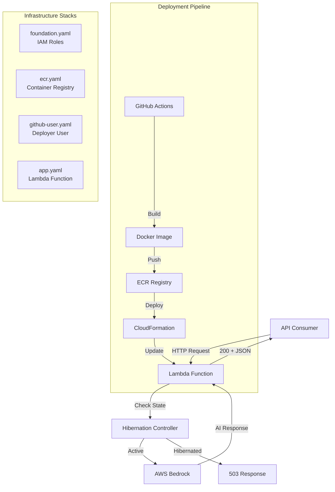

# Design Document: Serverless Bedrock Chat

## Overview

The Serverless Bedrock Chat system is a containerized AWS Lambda function that provides an HTTP API for AI-powered chat interactions using AWS Bedrock's Claude 3 Haiku model. The architecture emphasizes cost efficiency through hibernation mode, automated deployment via GitHub Actions, and infrastructure-as-code principles using CloudFormation.

The system consists of four main components:
1. **Lambda Handler**: Processes HTTP requests and orchestrates chat interactions
2. **Bedrock Integration**: Manages AI model invocation and response parsing
3. **Hibernation Controller**: Enforces availability based on environment configuration
4. **Infrastructure Stack**: CloudFormation templates defining all AWS resources

## Architecture

### High-Level Architecture



### Component Interaction Flow

**Request Processing Flow:**
1. API consumer sends HTTP request with JSON body containing "question" field
2. Lambda handler parses request body and extracts question (defaults to "whats your name?" if missing)
3. Hibernation controller checks SYSTEM_STATE environment variable
4. If HIBERNATED: return HTTP 503 with error message
5. If ACTIVE: invoke Bedrock client with question
6. Bedrock client formats message and calls converse API
7. Parse AI response and return HTTP 200 with JSON body

**Deployment Flow:**
1. Developer pushes code to main branch
2. GitHub Actions workflow triggers
3. Authenticate to AWS using stored secrets
4. Build Docker container with Lambda handler
5. Tag image with Git commit SHA
6. Push image to ECR
7. Deploy CloudFormation stack with new image URI
8. Lambda function updates with new container

### Technology Stack

- **Runtime**: Python 3.12 on AWS Lambda
- **AI Model**: Claude 3 Haiku (anthropic.claude-3-haiku-20240307-v1:0)
- **Container**: Docker with AWS Lambda Python 3.12 base image
- **Infrastructure**: AWS CloudFormation
- **CI/CD**: GitHub Actions
- **AWS Services**: Lambda, Bedrock, ECR, IAM, CloudWatch Logs

## Components and Interfaces

### Lambda Handler (`lambda/handler.py`)

**Responsibility**: Main entry point for Lambda invocations, orchestrates request processing

**Interface**:
```python
def lambda_handler(event: dict, context: LambdaContext) -> dict:
    """
    Processes incoming HTTP requests and returns AI-generated responses.
    
    Args:
        event: Lambda event containing request body
        context: Lambda context object
        
    Returns:
        dict with statusCode and body fields
    """
```

**Behavior**:
- Parse JSON body from event
- Extract "question" field (default: "whats your name?")
- Check hibernation state via environment variable
- If hibernated: return 503 status
- If active: invoke Bedrock client
- Return 200 with AI response in JSON format

**Error Handling**:
- Gracefully handle JSON parsing errors
- Gracefully handle Bedrock API failures
- Log all errors to CloudWatch

### Bedrock Client

**Responsibility**: Manages interaction with AWS Bedrock service

**Interface**:
```python
def invoke_bedrock(question: str) -> str:
    """
    Invokes AWS Bedrock Claude 3 Haiku model with user question.
    
    Args:
        question: User's question text
        
    Returns:
        AI-generated response text
    """
```

**Configuration**:
- Model ID: "anthropic.claude-3-haiku-20240307-v1:0"
- Max tokens: 200
- API: converse (synchronous invocation)

**Message Format**:
```python
{
    "role": "user",
    "content": [{"text": question}]
}
```

**Response Parsing**:
- Extract text from response["output"]["message"]["content"][0]["text"]

### Hibernation Controller

**Responsibility**: Enforces system availability based on configuration

**Interface**:
```python
def is_hibernated() -> bool:
    """
    Checks if system is in hibernation mode.
    
    Returns:
        True if SYSTEM_STATE is "HIBERNATED", False otherwise
    """
```

**Behavior**:
- Read SYSTEM_STATE environment variable
- Return True if value is "HIBERNATED"
- Return False if value is "ACTIVE" or any other value
- Check performed on every request (no caching)

### Infrastructure Stack

**Foundation Stack (`infra/foundation.yaml`)**:
- IAM role for Lambda execution
- Permissions: Bedrock invoke, CloudWatch Logs write
- Outputs: Lambda role ARN for use in app stack

**ECR Stack (`infra/ecr.yaml`)**:
- ECR repository for container images
- Repository name: "bedrock-agent"
- Outputs: Repository URI for deployment pipeline

**GitHub User Stack (`infra/github-user.yaml`)**:
- IAM user: "github-bedrock-deployer"
- Permissions: ECR push, CloudFormation deploy, Lambda update, IAM pass role
- Outputs: User ARN (access keys created manually)

**App Stack (`infra/app.yaml`)**:
- Lambda function with container image
- Environment variables: SYSTEM_STATE
- Parameters: ImageUri, LambdaRoleArn, SystemState, tags
- Function name: "ChatFunction"

## Data Models

### Request Model

```python
{
    "question": str  # Optional, defaults to "whats your name?"
}
```

**Validation**:
- Body must be valid JSON
- "question" field is optional
- If present, "question" must be a string

### Response Model (Success)

```python
{
    "statusCode": 200,
    "body": str  # JSON string containing AI response
}
```

**Body Content**:
```json
{
    "response": "AI-generated text"
}
```

### Response Model (Hibernated)

```python
{
    "statusCode": 503,
    "body": str  # JSON string with error message
}
```

**Body Content**:
```json
{
    "error": "System is currently hibernated"
}
```

### Bedrock Request Model

```python
{
    "modelId": "anthropic.claude-3-haiku-20240307-v1:0",
    "messages": [
        {
            "role": "user",
            "content": [{"text": str}]
        }
    ],
    "inferenceConfig": {
        "maxTokens": 200
    }
}
```

### Bedrock Response Model

```python
{
    "output": {
        "message": {
            "content": [
                {"text": str}
            ]
        }
    }
}
```

### CloudFormation Parameters

**Foundation Stack**:
- ProjectTag: string
- OwnerTag: string
- EnvTag: string

**App Stack**:
- ImageUri: string (ECR image URI with tag)
- LambdaRoleArn: string (ARN from foundation stack)
- SystemState: string (ACTIVE or HIBERNATED)
- ProjectTag: string
- OwnerTag: string
- EnvTag: string

### GitHub Secrets

```python
{
    "AWS_ACCESS_KEY_ID": str,
    "AWS_SECRET_ACCESS_KEY": str,
    "AWS_REGION": str,
    "ECR_REPO_URI": str,
    "LAMBDA_ROLE_ARN": str,
    "STACK_NAME": str,
    "PROJECT": str,
    "OWNER": str,
    "ENV": str
}
```


## Correctness Properties

A property is a characteristic or behavior that should hold true across all valid executions of a system—essentially, a formal statement about what the system should do. Properties serve as the bridge between human-readable specifications and machine-verifiable correctness guarantees.

### Application Logic Properties

Property 1: Question forwarding to Bedrock
*For any* valid question string, when the Chat_Service receives a request with that question, the Bedrock_Client should be invoked with exactly that question text.
**Validates: Requirements 1.1**

Property 2: Successful response format
*For any* successful Bedrock response, the Chat_Service should return HTTP status code 200 and a body that is valid JSON containing the AI-generated text.
**Validates: Requirements 1.3**

Property 3: Request parsing
*For any* valid JSON request body containing a "question" field, the Chat_Service should correctly extract the question value.
**Validates: Requirements 1.4**

Property 4: Response JSON structure
*For any* response returned by the Chat_Service, the body should be valid JSON that can be parsed without errors.
**Validates: Requirements 1.5**

Property 5: Message role formatting
*For any* question string, when formatted for Bedrock, the message should have role "user" and content containing the question text.
**Validates: Requirements 2.4**

Property 6: Response text extraction
*For any* valid Bedrock response structure, the text extraction should successfully retrieve the AI-generated content from the nested response object.
**Validates: Requirements 2.5**

Property 7: Invalid JSON handling
*For any* invalid JSON input, the Chat_Service should handle the parsing error gracefully without crashing and return an appropriate error response.
**Validates: Requirements 8.1**

Property 8: Error status codes
*For any* error condition (invalid input, Bedrock failure, hibernation), the Chat_Service should return a non-200 HTTP status code.
**Validates: Requirements 8.5**

### Configuration and Infrastructure Properties

The following properties validate configuration and infrastructure setup through static analysis of templates and configuration files:

Property 9: Model configuration
The Bedrock_Client configuration should specify model ID "anthropic.claude-3-haiku-20240307-v1:0" and max tokens of 200.
**Validates: Requirements 2.1, 2.2**

Property 10: Converse API usage
The Bedrock_Client should use the converse API method for model invocation.
**Validates: Requirements 2.3**

Property 11: Hibernation state handling
When SYSTEM_STATE is "HIBERNATED", the Chat_Service should return HTTP 503 with an error message. When "ACTIVE", normal processing should occur.
**Validates: Requirements 3.1, 3.2, 3.3, 3.5**

Property 12: Foundation stack IAM permissions
The foundation.yaml template should define an IAM role with policies granting Bedrock invoke and CloudWatch Logs write permissions.
**Validates: Requirements 5.1, 9.1, 9.2**

Property 13: ECR repository definition
The ecr.yaml template should define an ECR repository resource.
**Validates: Requirements 5.2**

Property 14: GitHub deployer user definition
The github-user.yaml template should define an IAM user with deployment permissions (ECR, CloudFormation, Lambda, IAM pass role).
**Validates: Requirements 5.3, 9.3**

Property 15: Lambda function definition
The app.yaml template should define a Lambda function resource with container image configuration and SYSTEM_STATE environment variable.
**Validates: Requirements 5.4, 5.7**

Property 16: Resource tagging
All CloudFormation templates should include parameters for Project, Owner, and Environment tags and apply them to resources.
**Validates: Requirements 5.5**

Property 17: Cross-stack parameters
The app.yaml template should use parameters for ImageUri and LambdaRoleArn to reference values from other stacks.
**Validates: Requirements 5.6, 9.4**

Property 18: Deployment pipeline trigger
The GitHub Actions workflow should trigger on push to the main branch.
**Validates: Requirements 6.1**

Property 19: Pipeline AWS authentication
The GitHub Actions workflow should use AWS_ACCESS_KEY_ID and AWS_SECRET_ACCESS_KEY secrets for authentication.
**Validates: Requirements 6.2**

Property 20: Pipeline Docker build
The GitHub Actions workflow should include a step that builds the Docker container from the Lambda handler code.
**Validates: Requirements 6.3**

Property 21: Pipeline image tagging
The GitHub Actions workflow should tag container images with the Git commit SHA.
**Validates: Requirements 6.4**

Property 22: Pipeline ECR push
The GitHub Actions workflow should include a step that pushes the built container image to ECR.
**Validates: Requirements 6.5**

Property 23: Pipeline CloudFormation deployment
The GitHub Actions workflow should include a step that deploys the CloudFormation stack with the new image URI.
**Validates: Requirements 6.6**

Property 24: Pipeline secrets usage
The GitHub Actions workflow should reference all required secrets: AWS credentials, ECR_REPO_URI, LAMBDA_ROLE_ARN, STACK_NAME, and tag values.
**Validates: Requirements 6.7**

Property 25: Bootstrap script sequence
The bootstrap.sh script should deploy CloudFormation stacks in the correct order: foundation, then ECR, then GitHub user.
**Validates: Requirements 7.1, 7.5**

Property 26: Bootstrap outputs
The foundation and ECR CloudFormation templates should define outputs for values needed in subsequent deployments (role ARN, repository URI).
**Validates: Requirements 7.2**

Property 27: IAM capabilities flag
The bootstrap script should use --capabilities CAPABILITY_NAMED_IAM flag when deploying stacks that create IAM resources.
**Validates: Requirements 9.5**

## Error Handling

### Request Processing Errors

**Invalid JSON Input**:
- Catch JSON parsing exceptions
- Return HTTP 400 with error message
- Log the error with request context

**Missing Question Field**:
- Not an error condition
- Use default question: "whats your name?"
- Proceed with normal processing

**Bedrock API Failures**:
- Catch boto3 exceptions from Bedrock calls
- Return HTTP 500 with generic error message
- Log the full exception details for debugging
- Do not expose internal error details to clients

### Hibernation State

**System Hibernated**:
- Check SYSTEM_STATE environment variable before processing
- Return HTTP 503 immediately if "HIBERNATED"
- Include error message: "System is currently hibernated"
- Do not invoke Bedrock or perform any processing

### Infrastructure Errors

**CloudFormation Deployment Failures**:
- GitHub Actions workflow will fail if CloudFormation deploy fails
- Check CloudFormation console for stack events and error messages
- Common issues: missing parameters, insufficient permissions, resource conflicts

**ECR Push Failures**:
- GitHub Actions workflow will fail if ECR push fails
- Verify ECR repository exists and deployer has push permissions
- Check ECR authentication is successful

**Bootstrap Failures**:
- Script will exit on first failed CloudFormation deployment
- Check AWS CLI output for specific error messages
- Verify AWS credentials and permissions
- Ensure parameters are provided correctly

### Logging Strategy

**Request Logging**:
- Log incoming request with question field
- Log hibernation state check result
- Log Bedrock invocation (without full request/response for cost)
- Log final response status code

**Error Logging**:
- Log full exception stack traces
- Include request context (question, event structure)
- Log environment state (SYSTEM_STATE value)
- Use structured logging for easier CloudWatch Insights queries

## Testing Strategy

### Dual Testing Approach

This system requires both unit tests and property-based tests for comprehensive coverage:

- **Unit tests**: Verify specific examples, edge cases, and error conditions
- **Property tests**: Verify universal properties across all inputs

Together, these approaches provide comprehensive coverage where unit tests catch concrete bugs and property tests verify general correctness.

### Property-Based Testing

**Framework**: Use `hypothesis` library for Python property-based testing

**Configuration**:
- Minimum 100 iterations per property test
- Each test must reference its design document property
- Tag format: `# Feature: serverless-bedrock-chat, Property N: [property text]`

**Property Test Coverage**:

1. **Property 1 (Question forwarding)**: Generate random question strings, mock Bedrock client, verify invocation with exact question
2. **Property 2 (Response format)**: Generate random Bedrock responses, verify status code 200 and valid JSON body
3. **Property 3 (Request parsing)**: Generate random JSON bodies with question fields, verify correct extraction
4. **Property 4 (Response JSON)**: Generate random responses, verify all are valid JSON
5. **Property 5 (Message formatting)**: Generate random questions, verify message structure has correct role
6. **Property 6 (Response extraction)**: Generate random Bedrock response structures, verify text extraction
7. **Property 7 (Invalid JSON)**: Generate invalid JSON strings, verify graceful error handling
8. **Property 8 (Error status codes)**: Generate various error conditions, verify non-200 status codes

### Unit Testing

**Framework**: Use `pytest` for Python unit testing

**Unit Test Coverage**:

**Lambda Handler Tests**:
- Test default question when "question" field is missing (Property 9 - example)
- Test hibernation mode returns 503 (Property 11 - example)
- Test active mode allows processing (Property 11 - example)
- Test Bedrock API failure handling (Property 8.2 - example)

**Configuration Tests**:
- Verify model ID is "anthropic.claude-3-haiku-20240307-v1:0" (Property 9)
- Verify max tokens is 200 (Property 9)
- Verify converse API is used (Property 10)

**Infrastructure Tests** (static analysis):
- Parse foundation.yaml and verify IAM permissions (Property 12)
- Parse ecr.yaml and verify ECR repository (Property 13)
- Parse github-user.yaml and verify IAM user (Property 14)
- Parse app.yaml and verify Lambda function (Property 15)
- Verify all templates include tag parameters (Property 16)
- Verify app.yaml uses parameters for cross-stack references (Property 17)
- Parse deploy.yaml and verify trigger configuration (Property 18)
- Verify workflow uses AWS authentication secrets (Property 19)
- Verify workflow includes Docker build step (Property 20)
- Verify workflow tags with commit SHA (Property 21)
- Verify workflow pushes to ECR (Property 22)
- Verify workflow deploys CloudFormation (Property 23)
- Verify workflow uses all required secrets (Property 24)
- Parse bootstrap.sh and verify deployment order (Property 25)
- Verify templates define required outputs (Property 26)
- Verify bootstrap script uses IAM capabilities flag (Property 27)

### Integration Testing

**Local Testing**:
- Use AWS SAM or LocalStack to test Lambda function locally
- Mock Bedrock responses for cost efficiency
- Test full request/response cycle

**Deployment Testing**:
- Deploy to a test AWS account
- Verify CloudFormation stacks deploy successfully
- Test actual Bedrock integration with real API calls
- Verify hibernation mode works correctly
- Test GitHub Actions pipeline in a test repository

### Test Organization

```
tests/
├── unit/
│   ├── test_handler.py          # Lambda handler unit tests
│   ├── test_bedrock_client.py   # Bedrock integration unit tests
│   └── test_hibernation.py      # Hibernation controller unit tests
├── property/
│   ├── test_request_properties.py    # Properties 1, 3, 4, 7
│   ├── test_response_properties.py   # Properties 2, 8
│   └── test_bedrock_properties.py    # Properties 5, 6
└── infrastructure/
    ├── test_cloudformation.py   # Properties 12-17, 25-27
    └── test_pipeline.py         # Properties 18-24
```

### Mocking Strategy

**Bedrock Client Mocking**:
- Mock `boto3.client('bedrock-runtime')` for unit and property tests
- Use `unittest.mock` or `pytest-mock`
- Mock both successful responses and error conditions

**Environment Variable Mocking**:
- Mock `os.environ` for hibernation state tests
- Test both "ACTIVE" and "HIBERNATED" states

**CloudFormation Template Testing**:
- Use `pyyaml` or `cfn-lint` to parse and validate templates
- Assert on specific resource properties and configurations

### CI/CD Testing Integration

**Pre-deployment Testing**:
- Run all unit tests before building Docker image
- Run property tests before building Docker image
- Run infrastructure tests to validate templates
- Fail pipeline if any tests fail

**Post-deployment Testing**:
- Run smoke tests against deployed Lambda function
- Verify function responds correctly
- Test hibernation mode toggle
- Verify CloudWatch logs are being written
